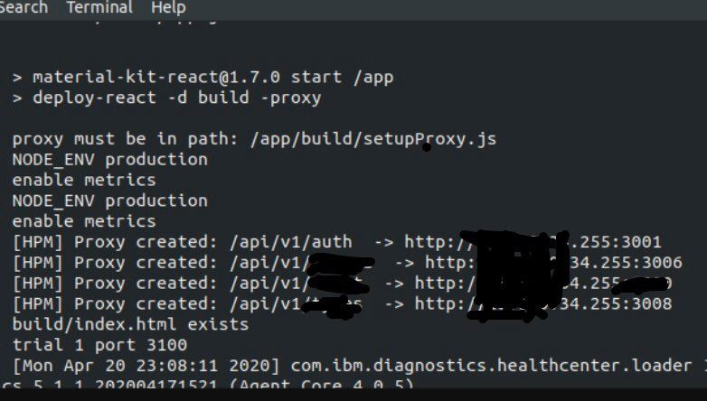

# deploy-react

## install
```javascript
npm install -g deploy-react
```
<hr>

### New feature :fire: Proxy :fire:

###### deploy-react with proxy in "production" :


> setupProxy.js must be in the src folder ./src/setupProxy.js

setupProxy.js :point_down: template <br/>
:point_right: <b> http-proxy-middleware </b>  https://github.com/chimurai/http-proxy-middleware
```javascript
deploy-react -d build -proxy
```
<hr>

### deploy current folder
```javascript
cd react/app/build_folder

deploy-react .
```

### deploy to specific directory
```javascript
deploy-react -d specificDirectory
```

### deploy to specific entry name
```javascript
deploy-react -e entryName.html
```

### deploy to specific port
```javascript
deploy-react -p 8080
```
### deploy with https
```javascript
deploy-react -https .
```

### ** hint ,, you can write this scripts in package.json of react to get auto deploy
```javascript
"scripts": {
	"postinstall":"npm install -g deploy-react",
    "start": "deploy-react -d build"
	}
```

## License

  [MIT](LICENSE)
