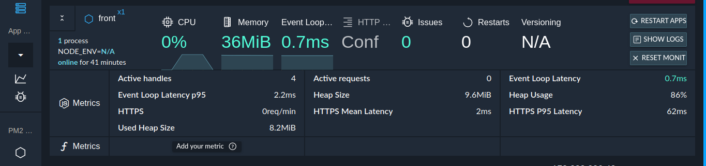

# deploy-react

## install
```javascript
npm install -g deploy-react
```
<hr>

### New feature :fire: pm2 :fire:

#### deploy-react with pm2:


**Now** you can deploy your front end server with pm2 clustering and enjoy with all its amazing features

```bash
pm2 start -f --name front deploy-react -- -https -d dist -p 443
```
**pass arguments to pm2 process**
```bash
pm2 start deploy-react -- arg1 arg2 arg3
```
## more about pm2 :point_right: [click](https://pm2.keymetrics.io/) :point_left:

<hr>

### New feature :fire: Proxy :fire:

#### deploy-react with proxy in "production" :


> setupProxy.js must be in the src folder ./src/setupProxy.js

setupProxy.js :point_down: template <br/>
:point_right: <b> http-proxy-middleware </b>  https://github.com/chimurai/http-proxy-middleware
```javascript
deploy-react -d build -proxy
```
<hr>

### deploy current folder
```javascript
cd react/app/build_folder

deploy-react .
```

### deploy to specific directory
```javascript
deploy-react -d specificDirectory
```

### deploy to specific entry name
```javascript
deploy-react -e entryName.html
```

### deploy to specific port
```javascript
deploy-react -p 8080
```
### deploy with https
**Note** the next files must be exist in parent dir of the entry file
<br/>
- -> build/index.html
- sslcert/server.key
- sslcert/server.crt
- sslcert/ca.crt // if you don't have create an empty file "touch ca.crt"

```javascript
deploy-react -https .
```

### **Hint** ,, you can write this scripts in package.json of react to get auto deploy
```javascript
"scripts": {
	"postinstall":"npm install -g deploy-react",
    "start": "deploy-react -d build"
	}
```

## License

  [MIT](LICENSE)
